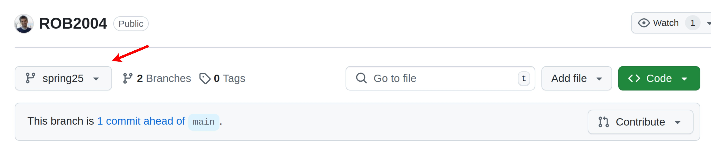

# ROB2004 Robotics manipulation and locomotion

**Note:** For Spring 2025, use the `spring25` branch in this repository. You can directly download it by selecting this branch as:

 

and downloading it directly or switching to it after the cloning as:

```bash
cd ~
git clone git@github.com:righetti/ROB2004.git
git checkout spring25
```

This repository provides material used for the class **ROB2004 Robotic manipulation and locomotion** taught at New York University by [Ludovic Righetti](https://engineering.nyu.edu/faculty/ludovic-righetti).
You are free to use and copy this material (at your own risk), please reference the material if you use it.

## Working with python
We work with Python 3.8 using numpy, scipy, matplotlib (come with Anaconda by default). Most the material will be given as Jupyter notebooks.

Anaconda is a straightforward, multi-platform, easy-to-use python distribution. It can be downloaded here https://www.anaconda.com/download/ and extensive documentation is available here https://docs.anaconda.com/anaconda/

Jupyter (comes with default Anaconda installation) is a great way to create notebooks for python. A simple tutorial can be found here https://jupyter-notebook-beginner-guide.readthedocs.io/en/latest/
 
Python tutorial (the web is full of great tutorials). Here are links to start: 
https://docs.python.org/3.8/tutorial/index.html

Numpy for people coming from Matlab: http://mathesaurus.sourceforge.net/matlab-numpy.html

Plotting with Python: http://matplotlib.org/users/pyplot_tutorial.html


## Issues / Feedback
We welcome feedback. If you find any issues, errors or have any ideas to improve the material, feel free to [create an issue](https://help.github.com/en/articles/creating-an-issue) and we will try to address it.


## Contributors
The material has been developped by [Ludovic Righetti](https://engineering.nyu.edu/faculty/ludovic-righetti).
